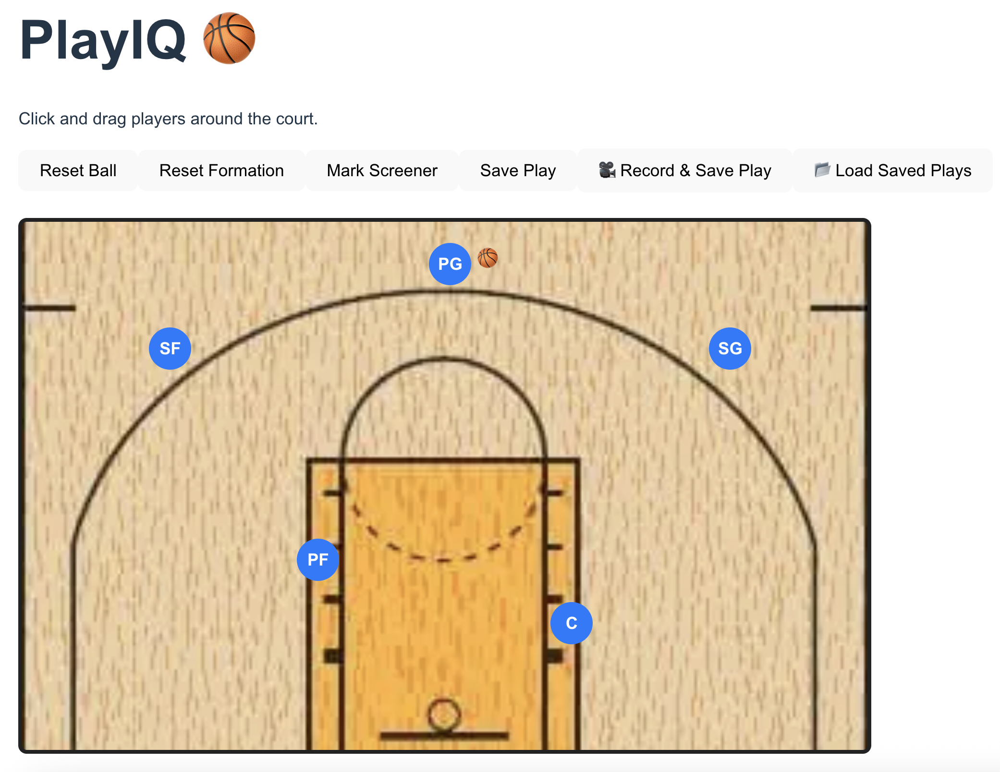

# 🏀 PlayIQ

Interactive web app for designing and visualizing basketball plays.

PlayIQ allows coaches and players to create, edit, and share offensive and defensive plays in a visual, intuitive way — similar to drawing on a whiteboard, but smarter.

---

## 🎬 Preview



---

## 🚀 What is PlayIQ?

PlayIQ is a full-stack application that enables users to:

- Add players to a basketball court
- Move players dynamically
- Draw movement paths (arrows)
- Simulate passes between players
- Visually design plays in real time

The goal is to build a modern, interactive tool for coaches instead of static diagrams.

---

## ✨ Features (Current)

- 🎯 Interactive basketball court
- 🧍 Player creation & positioning
- ➡️ Dynamic movement paths per player
- 🏀 Ball ownership & passing system
- 🎥 Visual play simulation

---

## 🧱 Tech Stack

**Frontend**
- React + TypeScript
- Canvas / Web-based rendering

**Backend**
- Node.js (in progress)

**Tools**
- Git & GitHub
- Docker (dev environment)

---

## 🛠️ How to Run Locally

### 1. Clone the repository

```bash
git clone https://github.com/DanielRachamim1234/PlayIQ.git
cd PlayIQ